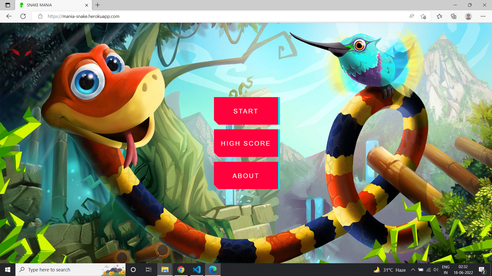
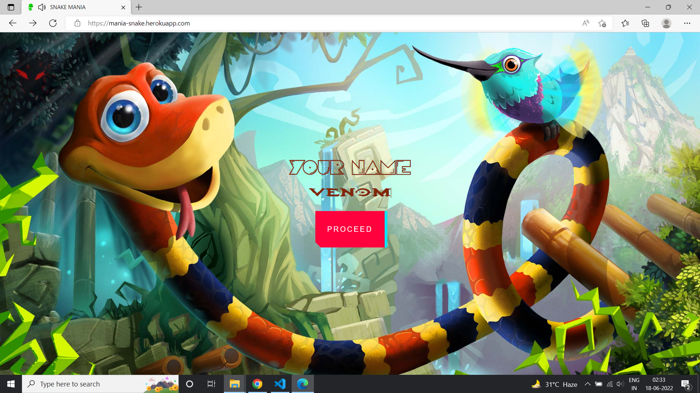
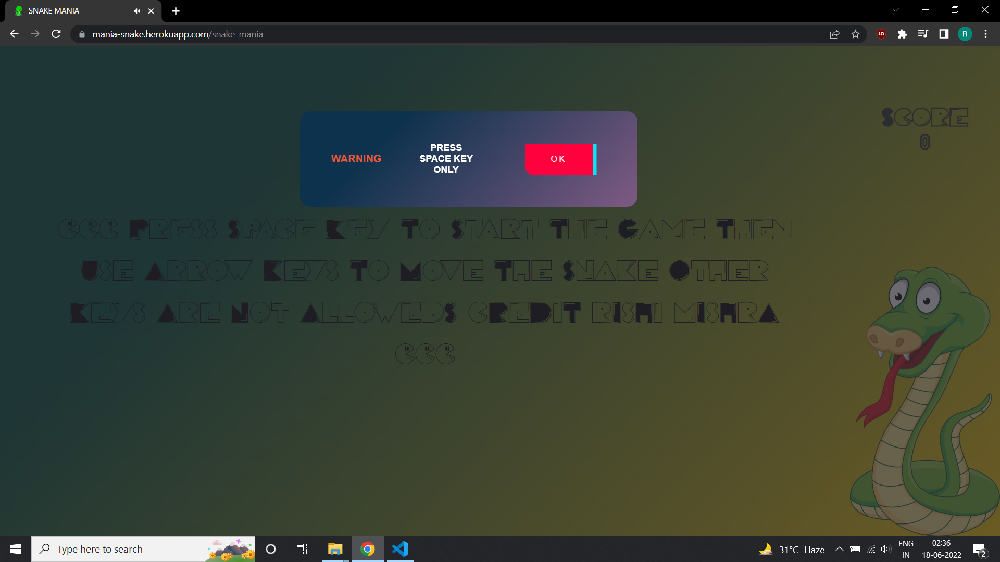
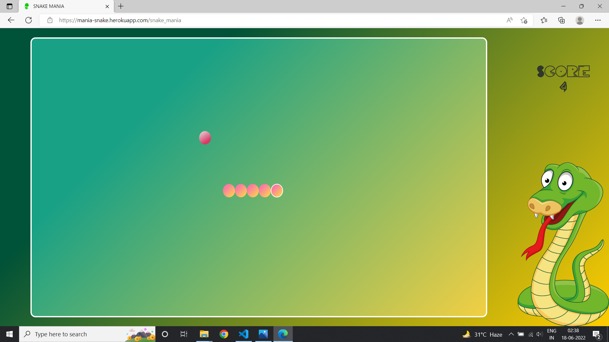
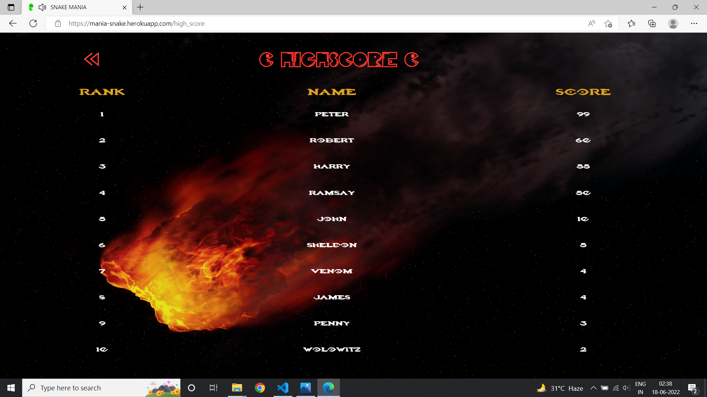

#LIVE URL
```
https://mania-snake.herokuapp.com/
```
# About Game
• Snake is a 2D game hosted on Heroku.<br>
• Created by using HTML, CSS and JavaScript.<br>
• It has music support and it is fully responsive.<br>

### Steps To Follow
1. Clone the repository
2. Install dependencies using 
    ```bash
    npm install
    ```
3. Run the game on local server by using the command
    ```bash
    npm start
    ```
4. Some additional commands
    ```bash
    npm install node-localstorage
    heroku git:remote -a mania-snake
    ````

## Screenshot

 

 

 

 

 

 

 
